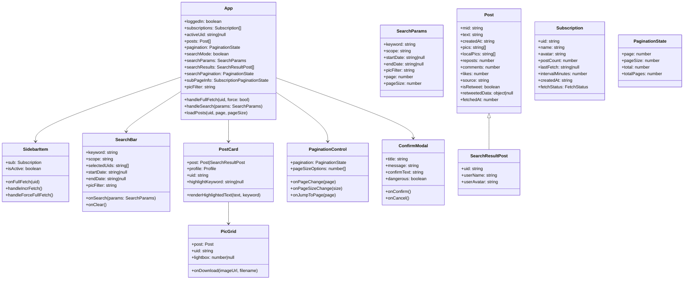
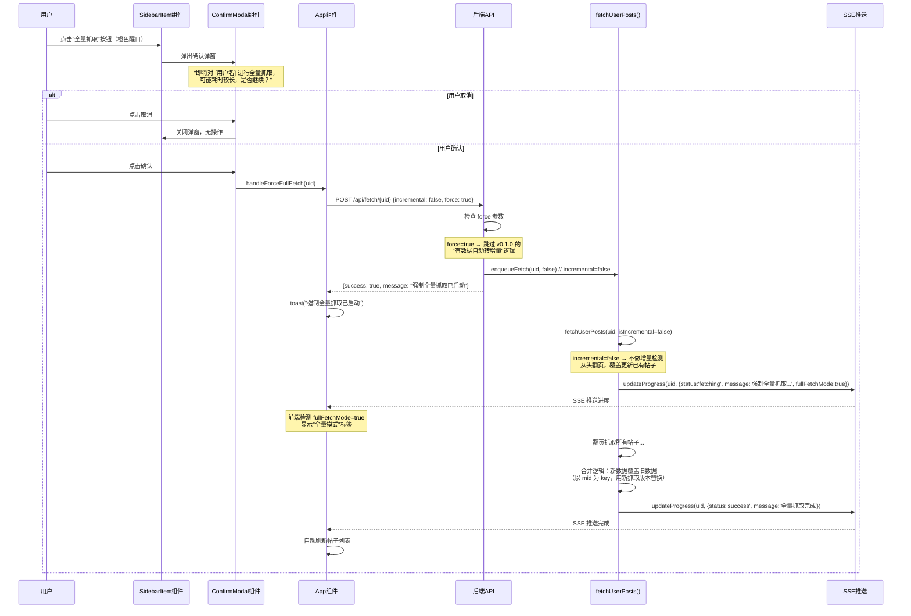

# 微博归档器 v0.2.0 系统架构设计

> 架构师：高见远（Gao） | 版本：v0.2.0 | 日期：2026-05-21

---

## 1. 实现方案 + 框架选型

### 1.1 技术栈决策

**保持现有技术栈不变**，不引入新的框架或库：

| 层级 | 技术 | 说明 |
|------|------|------|
| 后端 | Express + Playwright + Axios | 维持不变 |
| 前端 | React 18 CDN + Babel Standalone | 维持单文件 app.js + Babel 浏览器编译 |
| 数据存储 | 本地 JSON 文件 + 内存 LRU 缓存 | 维持不变 |
| 样式 | 纯 CSS（public/styles.css） | 维持不变 |

### 1.2 关键技术决策

#### D1：强制全量抓取 — 绕过增量检测

**现状**：v0.1.0 的 `POST /api/fetch/:uid` 路由中有逻辑：如果用户已有帖子数据，会自动将 `incremental` 改为 `true`（第 1835-1853 行）。

**方案**：新增 `force` 参数（`POST /api/fetch/:uid` body 中 `{ incremental: false, force: true }`）。当 `force=true` 时，跳过 v0.1.0 的"有数据自动转增量"逻辑，直接传 `incremental=false` 给 `fetchUserPosts()`。同时，`fetchUserPosts()` 在 `incremental=false` 时，对已存在的帖子采用**覆盖更新**策略（以最新数据为准），而非仅追加新帖子。

**关键改动点**：
- `server.js`：`POST /api/fetch/:uid` 路由增加 `force` 参数判断
- `server.js`：`fetchUserPosts()` 的合并逻辑需调整 — 全量模式下用新数据覆盖旧数据
- `public/app.js`：`SidebarItem` 组件新增"全量抓取"按钮 + 确认弹窗
- SSE 推送：全量抓取时标记 `fullFetchMode: true`，前端可区分展示

#### D2：搜索 API — JSON 全量扫描 + 简单内存缓存

**方案**：新增 `GET /api/search` API，支持关键字、范围（全部/指定用户uid列表）、时间范围、有图/无图筛选。搜索流程：
1. 根据 `scope` 参数确定要搜索的 uid 列表
2. 遍历各 uid 的 `posts.json`（先查内存缓存，未命中则读磁盘并缓存）
3. 在内存中对每个帖子的 `text` 字段做大小写不敏感的 `includes()` 匹配
4. 对匹配结果应用时间范围和图片筛选
5. 返回分页结果

**缓存策略**：复用现有的 `postCache`（Map<uid, {data, ts}>，TTL 60s），搜索时也通过 `cacheGet/cacheSet` 读取数据。无需额外缓存层。

**性能考量**：v0.2.0 先做基础实现。单个 JSON 文件全量加载到内存扫描，对于单个用户数千条帖子完全可接受；跨多个用户搜索时，如果订阅数较多可能有秒级延迟，后续版本可引入倒排索引优化。

#### D3：帖子分页增强

**现状**：后端 `GET /api/posts/:uid` 已支持 `page` 和 `pageSize` 参数，前端 `API.posts()` 硬编码 `pageSize=20`，前端使用"加载更多"按钮追加数据。

**方案**：
- 前端增加 `pageSize` 选择器（10/20/30/40/50）
- 前端增加页码输入框 + 跳转功能
- 前端显示"第 X / Y 页"
- `pageSize` 持久化到 `localStorage`（key: `weibo_archiver_posts_page_size`）
- 前端 `API.posts()` 方法增加 `pageSize` 参数
- 切换 `pageSize` 或页码跳转时重新请求对应页，替换帖子列表（而非追加）

#### D4：订阅列表分页 + 排序

**现状**：`GET /api/subscriptions` 返回全部订阅列表，前端一次性渲染所有 `SidebarItem`。

**方案**：
- 后端 `GET /api/subscriptions` 增加 `page`、`pageSize`、`sort` 查询参数
- 默认按用户名字母升序排序（使用 `localeCompare('zh-CN')`）
- 前端侧边栏底部增加分页控件
- `pageSize` 持久化到 `localStorage`（key: `weibo_archiver_subs_page_size`）
- 保持现有的全部数据加载逻辑（订阅列表通常不多），分页在前端做即可（后端仍返回全部数据，前端排序+分页展示）

> **决策简化**：由于订阅数量通常远少于帖子数（一般几十个），订阅列表分页+排序完全在前端完成，后端 API 无需改动。这样既满足需求又减少后端改动量。

#### D5：图片下载按钮

**方案**：前端在 `PicGrid` 组件的图片 hover 时显示下载图标。点击后通过 `<a>` 标签的 `download` 属性触发浏览器下载：
- 下载 URL：`/api/images/:uid/:filename?download=true`
- 后端在现有 `/api/images/:uid/:filename` 路由上增加 `download` 查询参数支持，设置 `Content-Disposition: attachment` 响应头
- 文件名格式：`{用户名}_{mid}_{序号}.{ext}`

#### D6：搜索结果高亮

**方案**：前端 `PostCard` 组件新增 `highlightKeyword` prop，当存在时，对 `post.text` 中匹配关键字的部分用 `<mark>` 标签包裹渲染。使用 `String.split()` + `Array.map()` 实现大小写不敏感的高亮分割。

---

## 2. 文件列表及相对路径

| 文件路径 | 操作 | 职责说明 |
|----------|------|----------|
| `server.js` | 修改 | 新增搜索 API、全量抓取 force 参数、图片下载 Content-Disposition、版本号更新 |
| `package.json` | 修改 | 版本号更新至 0.2.0 |
| `public/app.js` | 修改 | 新增搜索栏 UI、全量抓取按钮+确认弹窗、帖子分页控件、订阅分页排序、图片下载按钮、搜索高亮组件、版本号更新 |
| `public/styles.css` | 修改 | 新增搜索栏样式、全量抓取按钮样式、分页控件样式、图片下载按钮样式、搜索高亮样式 |
| `public/index.html` | 修改 | 版本号更新 |
| `docs/ARCHITECTURE-v0.2.0.md` | 新增 | 本架构文档 |
| `docs/sequence-diagram.mermaid` | 新增 | 时序图（搜索流程 + 强制全量抓取流程） |
| `docs/class-diagram.mermaid` | 新增 | 数据模型类图 |

---

## 3. 数据结构和接口

### 3.1 新增 API 接口

#### GET /api/search

搜索帖子内容。

| 参数 | 位置 | 类型 | 必填 | 默认值 | 说明 |
|------|------|------|------|--------|------|
| keyword | query | string | 是 | - | 搜索关键字 |
| scope | query | string | 否 | `"all"` | 搜索范围：`"all"` 全部订阅，或逗号分隔的 uid 列表（如 `"123,456"`） |
| startDate | query | string | 否 | - | 起始日期，格式 `YYYY-MM-DD` |
| endDate | query | string | 否 | - | 结束日期，格式 `YYYY-MM-DD` |
| picFilter | query | string | 否 | `"all"` | 图片筛选：`"all"` / `"withPics"` / `"noPics"` |
| page | query | number | 否 | `1` | 页码 |
| pageSize | query | number | 否 | `20` | 每页条数（最大 50） |

**返回值**：

```json
{
  "success": true,
  "data": {
    "posts": [
      {
        "mid": "string",
        "text": "string",
        "createdAt": "string",
        "pics": ["string"],
        "localPics": ["string"],
        "reposts": 0,
        "comments": 0,
        "likes": 0,
        "source": "string",
        "isRetweet": false,
        "retweetedData": null,
        "fetchedAt": 0,
        "uid": "string",
        "userName": "string",
        "userAvatar": "string"
      }
    ],
    "pagination": {
      "page": 1,
      "pageSize": 20,
      "total": 0,
      "totalPages": 1
    },
    "keyword": "搜索关键字"
  }
}
```

> 说明：搜索结果中的帖子比普通帖子列表多 `uid`、`userName`、`userAvatar` 字段，用于在前端标示帖子来源用户。

#### GET /api/images/:uid/:filename（增强）

新增 `download` 查询参数：

| 参数 | 位置 | 类型 | 必填 | 说明 |
|------|------|------|------|------|
| download | query | string | 否 | 值为 `"true"` 时，响应头添加 `Content-Disposition: attachment` 触发浏览器下载 |

#### POST /api/fetch/:uid（增强）

新增 `force` body 参数：

| 参数 | 位置 | 类型 | 必填 | 说明 |
|------|------|------|------|------|
| incremental | body | boolean | 否 | 是否增量抓取 |
| force | body | boolean | 否 | 值为 `true` 时，强制全量抓取（绕过"有数据自动转增量"逻辑） |

### 3.2 数据模型

#### SearchParams（前端 → 后端）

```
SearchParams {
  keyword: string          // 搜索关键字
  scope: "all" | string    // "all" 或逗号分隔的 uid 列表
  startDate: string | null  // YYYY-MM-DD
  endDate: string | null    // YYYY-MM-DD
  picFilter: "all" | "withPics" | "noPics"
  page: number
  pageSize: number
}
```

#### SearchResultPost（后端 → 前端，扩展自现有 Post 结构）

```
SearchResultPost extends Post {
  uid: string        // 来源用户 uid
  userName: string   // 来源用户名
  userAvatar: string // 来源用户头像
}
```

#### PaginationState（前端状态）

```
PaginationState {
  page: number
  pageSize: number    // 10 | 20 | 30 | 40 | 50
  total: number
  totalPages: number
}
```

#### SubscriptionPaginationState（前端状态）

```
SubscriptionPaginationState {
  page: number
  pageSize: number    // 10 | 20 | 30 | 40 | 50
  total: number
  totalPages: number
  sortBy: "name"      // v0.2.0 仅支持用户名字母排序
}
```

### 3.3 localStorage 约定

| Key | 类型 | 默认值 | 说明 |
|-----|------|--------|------|
| `weibo_archiver_posts_page_size` | number | `20` | 帖子列表每页条数 |
| `weibo_archiver_subs_page_size` | number | `10` | 订阅列表每页条数 |

### 3.4 类图



---

## 4. 程序调用流程

### 4.1 搜索流程时序图

```mermaid
sequenceDiagram
    participant User as 用户
    participant SB as SearchBar组件
    participant App as App组件
    participant API as 后端API
    participant Cache as 内存缓存(postCache)
    participant FS as 文件系统

    User->>SB: 输入关键字 + 选择范围 + 设置筛选条件
    User->>SB: 点击搜索/回车

    SB->>App: onSearch({keyword, scope, startDate, endDate, picFilter, page, pageSize})
    App->>App: 设置 searchMode=true, 保存 searchParams

    App->>API: GET /api/search?keyword=xxx&scope=all&startDate=...&page=1&pageSize=20
    
    API->>API: 解析 scope → 确定 uid 列表
    loop 遍历每个 uid
        API->>Cache: cacheGet(uid)
        alt 缓存命中
            Cache-->>API: 返回 posts 数组
        else 缓存未命中
            API->>FS: readJSON(posts.json)
            FS-->>API: 返回 posts 数组
            API->>Cache: cacheSet(uid, posts)
        end
    end

    API->>API: 遍历所有帖子，对 text 做 includes(keyword) 匹配
    API->>API: 应用时间范围筛选 (startDate ~ endDate)
    API->>API: 应用图片筛选 (picFilter)
    API->>API: 按时间倒序排列 + 分页切片

    API-->>App: {success: true, data: {posts, pagination, keyword}}

    App->>App: 设置 searchResults, searchPagination
    App->>App: 渲染搜索结果列表（PostCard 带 highlightKeyword）

    Note over App: PostCard 渲染时调用 renderHighlightedText<br/>将匹配关键字用 &lt;mark&gt; 标签高亮

    User->>App: 翻页操作
    App->>API: GET /api/search?keyword=xxx&...&page=2
    API-->>App: 返回第二页结果
```

### 4.2 强制全量抓取流程时序图



---

## 5. 任务列表

### T01: 项目基础设施更新

**编号**：T01  
**描述**：更新项目版本号、配置文件、架构文档  
**涉及文件**：
- `package.json` — 版本号更新至 0.2.0
- `public/index.html` — 标题版本号更新至 v0.2.0
- `docs/ARCHITECTURE-v0.2.0.md` — 本架构文档
- `docs/sequence-diagram.mermaid` — 时序图
- `docs/class-diagram.mermaid` — 类图
**依赖任务**：无  
**优先级**：P0

### T02: 后端核心功能（搜索 API + 强制全量抓取 + 图片下载增强）

**编号**：T02  
**描述**：
- 新增 `GET /api/search` 搜索 API（关键字搜索 + 范围选择 + 时间筛选 + 图片筛选 + 分页）
- 修改 `POST /api/fetch/:uid` 路由，新增 `force` 参数支持强制全量抓取
- 修改 `fetchUserPosts()` 全量模式下的合并逻辑：覆盖更新已有帖子
- SSE 推送增加 `fullFetchMode` 标记
- 修改 `GET /api/images/:uid/:filename` 路由，支持 `download=true` 参数
- 修改 `GET /api/health` 返回版本号 v0.2.0

**涉及文件**：
- `server.js` — 所有后端改动

**依赖任务**：T01  
**优先级**：P0

### T03: 前端核心组件（搜索栏 + 强制全量抓取按钮 + 分页控件 + 订阅分页排序）

**编号**：T03  
**描述**：
- 新增 `SearchBar` 组件（搜索输入框 + 范围下拉多选 + 时间范围选择器 + 图片筛选 + 搜索/清除按钮）
- 修改 `SidebarItem` 组件：新增"全量抓取"橙色按钮 + 点击弹出 `ConfirmModal`
- 新增 `ConfirmModal` 通用确认弹窗组件
- 新增 `PaginationControl` 通用分页控件组件（pageSize 选择器 + 页码导航 + 页码跳转 + 页码显示）
- 修改 `App` 组件：集成搜索栏、管理搜索状态（searchMode/searchParams/searchResults/searchPagination）、集成帖子分页控件、集成订阅列表前端分页+排序
- 修改 `API` 对象：新增 `search()` 方法，修改 `posts()` 方法支持 pageSize 参数，新增 `fullFetch()` 方法
- 帖子分页：切换 pageSize 时重新加载第一页，输入页码跳转，pageSize 持久化 localStorage
- 订阅分页：前端排序（localeCompare zh-CN）+ 前端分页，pageSize 持久化 localStorage
- 全量抓取进度提示：SSE 推送中 fullFetchMode=true 时显示"全量模式"标签
- 搜索结果替换帖子列表区域展示，清除搜索时恢复原始帖子列表

**涉及文件**：
- `public/app.js` — 所有前端逻辑改动

**依赖任务**：T02（依赖后端 API 接口可用）  
**优先级**：P0

### T04: 前端辅助功能 + 样式（图片下载 + 搜索高亮 + 全量模式标签 + 样式）

**编号**：T04  
**描述**：
- 修改 `PicGrid` 组件：图片 hover 时显示下载图标按钮，点击触发浏览器下载（`/api/images/:uid/:filename?download=true`）
- 修改 `PostCard` 组件：新增 `highlightKeyword` prop，搜索模式下高亮关键字（`<mark>` 标签）
- 全量模式标签：抓取进度条区域显示"全量模式"标签（基于 SSE `fullFetchMode` 字段）
- 搜索结果中显示帖子来源用户信息（uid + userName + userAvatar）
- 新增所有 v0.2.0 功能的 CSS 样式

**涉及文件**：
- `public/styles.css` — 新增搜索栏、分页控件、全量抓取按钮、图片下载按钮、搜索高亮、确认弹窗等样式
- `public/app.js` — PicGrid 下载功能、PostCard 高亮功能（部分修改）

**依赖任务**：T03（依赖前端组件结构已建立）  
**优先级**：P1

### T05: Git 仓库配置 + 集成验证

**编号**：T05  
**描述**：
- 完善 `.gitignore`（添加 `node_modules/`、`data/`、`logs/` 等）
- 新增 `README.md`（项目介绍、安装步骤、使用方法、截图、技术栈说明）
- 全流程集成测试验证：搜索 → 强制全量抓取 → 分页 → 图片下载 → 高亮
- 推送至 `git@github.com:lovesakuratears/WoTui-OnlyMyFavorite.git`

**涉及文件**：
- `.gitignore` — 完善
- `README.md` — 新增
- 其他文件 — 最终验证和微调

**依赖任务**：T04  
**优先级**：P2

### 任务依赖关系

```
T01 → T02 → T03 → T04 → T05
```

---

## 6. 依赖包列表

v0.2.0 **无需新增任何 npm 包**。所有功能均基于现有依赖实现：

| 包名 | 版本 | 用途 |
|------|------|------|
| express | ^4.18.2 | Web 服务（已有） |
| playwright | ^1.44.0 | 浏览器自动化抓取（已有） |
| axios | ^1.6.0 | HTTP 请求（已有） |
| cors | ^2.8.5 | CORS 支持（已有） |

搜索功能使用内存 JSON 扫描，无需额外搜索引擎库。分页功能使用已有的 `page`/`pageSize` 参数模式。

---

## 7. 共享知识（跨文件约定）

### 7.1 前后端接口约定

- 所有 API 返回格式：`{ success: boolean, data?: any, error?: string, message?: string }`
- 日期参数格式：`YYYY-MM-DD`（如 `2024-01-15`）
- 分页参数命名：`page`（从 1 开始）、`pageSize`（默认 20，最大 50）
- 搜索范围 `scope`：`"all"` 表示全部订阅，逗号分隔的 uid 字符串表示指定用户
- `picFilter` 参数值：`"all"` / `"withPics"` / `"noPics"`（前后端统一）
- 强制全量抓取：`POST /api/fetch/:uid` body 中 `force: true` + `incremental: false`

### 7.2 localStorage Key 命名约定

| Key | 说明 |
|-----|------|
| `weibo_archiver_posts_page_size` | 帖子列表每页条数 |
| `weibo_archiver_subs_page_size` | 订阅列表每页条数 |

所有 localStorage key 统一使用 `weibo_archiver_` 前缀。

### 7.3 搜索参数传递方式

搜索使用 `GET /api/search` + query parameters 传递，因为搜索是读操作，参数通过 URL 传递更语义化。`scope` 参数为逗号分隔的 uid 字符串（如 `scope=123,456,789`）。

### 7.4 SSE 事件扩展

v0.2.0 在 SSE `progress` 事件中新增 `fullFetchMode` 字段：

```json
{
  "type": "progress",
  "uid": "123",
  "status": "fetching",
  "message": "强制全量抓取...",
  "progress": 50,
  "total": 100,
  "fullFetchMode": true
}
```

前端根据 `fullFetchMode === true` 显示"全量模式"标签。

### 7.5 图片下载文件名约定

下载文件名格式：`{用户名}_{mid}_{序号}.{ext}`  
示例：`张三_5123456789_0.jpg`

### 7.6 前端搜索模式状态管理

搜索模式下 App 的关键状态：
- `searchMode: boolean` — 是否处于搜索模式
- `searchParams: SearchParams` — 当前搜索参数
- `searchResults: SearchResultPost[]` — 搜索结果帖子
- `searchPagination: PaginationState` — 搜索结果分页
- `searchKeyword: string` — 当前搜索关键字（用于高亮）

退出搜索模式时清空上述状态，恢复原始帖子列表。

---

## 8. 任务依赖图


---

## 9. 待明确事项

### 9.1 已确认的产品决策（来自 PRD）

| 决策项 | 结论 |
|--------|------|
| 全量抓取数据策略 | 覆盖更新（以最新数据为准） |
| 搜索性能 | v0.2.0 先基础实现（JSON 全量扫描 + 简单内存缓存） |
| 图片下载路径 | 默认浏览器下载路径 |
| 搜索范围选择 | 下拉多选 |
| 排序维度 | 仅用户名字母排序 |
| 分页参数持久化 | localStorage |

### 9.2 架构层面待确认

1. **搜索结果帖子数上限**：如果搜索结果特别多（数千条），全量扫描 + 排序可能需要数秒。建议搜索结果硬限制最多返回 1000 条，避免性能问题。→ **自决：采用分页机制自然限制，单页最大 50 条，总结果不设硬限制，但排序只对分页后的数据做，避免全量排序。**

2. **全量抓取时断点文件处理**：强制全量抓取时，是否需要清除旧的 checkpoint.json？→ **自决：需要清除。强制全量意味着从头开始，旧断点无意义。在 `POST /api/fetch/:uid` 路由中，当 `force=true` 时先删除 checkpoint.json 再入队。**

3. **搜索时的日期比较精度**：微博 `createdAt` 字段格式多样（如 `Thu May 16 10:30:00 +0800 2024`），日期比较时需要解析。→ **自决：后端搜索时将 `createdAt` 统一解析为 Date 对象与 `startDate`/`endDate` 比较，解析失败则跳过该帖子的日期筛选。**
